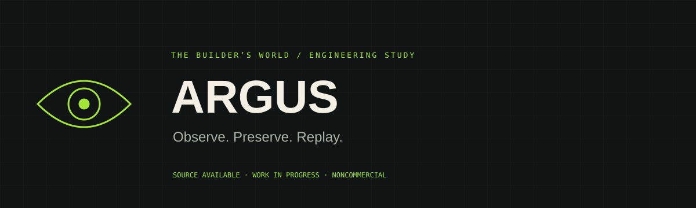
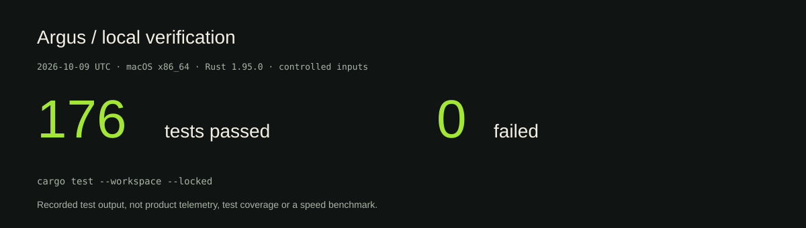
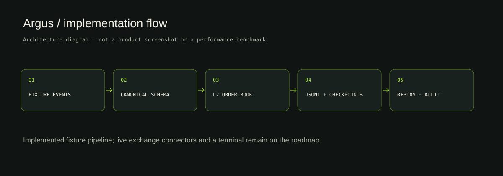
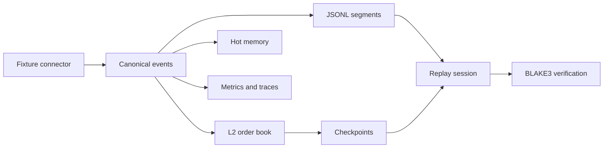

<p>   </p>

# ARGUS

**A Rust foundation for inspecting, preserving and replaying market data.**

ARGUS explores canonical market events, an L2 order book, storage/checkpoints, replay, audit trails and observability. This release is the **foundation of phases 0–6**, built around fixtures. The four-process platform is the target architecture, not four completed production applications.

[Case study](https://isaacvaleriano.netlify.app/en/projects/argus/) · [Architecture](docs/ARCHITECTURE.md) · [Verification](docs/VERIFICATION.md) · [Roadmap](docs/MILESTONES.md) · [Português](README.pt-BR.md)

## What can be verified today

| Evidence | Result | Reproduce / inspect |
|---|---:|---|
| Workspace test run | **176 passed · 0 failed** | `cargo test --workspace --locked`; [run record](docs/VERIFICATION.md) |
| Workspace composition | **20 crates** | [Cargo.toml](Cargo.toml) |
| Numeric representation | **i128 ticks / lots / minor units** | [argus-decimal](crates/argus-decimal/src/lib.rs) |
| L2 correctness exercise | **200 generated cases per property** | [property tests](crates/argus-orderbook/tests/property.rs) |
| Durable warm-tier implementation | **JSONL + checkpoints** | [storage](crates/argus-storage/src/lib.rs) |

These are local engineering checks, not trading performance, exchange throughput or latency guarantees. The run record states the revision and environment. Bench harnesses exist; published benchmark claims require a separately recorded run.



## Architecture





- **Contracts:** canonical IDs, exchange/receive/process time, capabilities, provenance and serializable schemas.
- **Order book:** slab-backed levels, snapshot/delta application, sequence-gap handling and reference comparisons.
- **Transport foundation:** a typed command bus and SPSC ring. The current ring uses process-allocated memory; OS-backed interprocess shared memory is unfinished.
- **Storage/replay:** hot memory, append-only JSONL segments, seek indexes and hash-verified checkpoints. Branch overlays preserve the original event sequence.
- **Risk/audit:** envelope and lifecycle primitives plus an append-only hash chain. A live order router and reconciliation daemon are not implemented here.
- **Observability:** a registry, Prometheus text exposition, structured JSON logs, trace primitives and sensitive-value formatting.

The target topology is Terminal / Data Plane / Risk Daemon / Research. [ADRs](docs/architecture/adr/) distinguish decisions from current implementation. There is **no finished GUI/dashboard** to screenshot; the diagram above is a diagram.

## Run locally

Rust stable and Cargo are required. `rust-toolchain.toml` selects stable; the workspace declares Rust 1.78 as its minimum, but the published run uses Rust 1.95.0 (the declared minimum was not validated).

```bash
git clone https://github.com/yMScorpion/Argus.git
cd Argus
cargo test --workspace --locked
cargo build --workspace --locked
# Optional benchmark run; do not compare numbers across machines without context:
cargo bench --workspace
```

The test suite uses fixtures and temporary local files. No exchange credentials are needed. See [Getting started](docs/GETTING_STARTED.md) for useful focused commands.

## Milestones and next steps

| Area | Current state | Next acceptance criterion |
|---|---|---|
| Contracts and fixture pipeline | Implemented and locally tested | Validate the contract against a read-only venue feed |
| L2 book and sequence handling | Implemented; reference/property tests | Capture/replay real feed gaps without divergence |
| JSONL / checkpoints / replay | Implemented | Exercise long-running recovery; evaluate a columnar backend |
| SPSC transport | In-process foundation | Add OS-backed shared memory and independent-process tests |
| Observability | Text metrics and JSON logs | Add HTTP/OTLP export and end-to-end propagation |
| Terminal / live connectors | Planned | Read-only terminal and one read-only connector |
| Risk execution / paper trading | Primitives only | Simulated venue and reconciliation before any live routing |

[Detailed current roadmap](docs/MILESTONES.md) · [Original 28-phase plan](docs/roadmap.md). A checked phase in the original plan means a foundation milestone; it does not imply every production subsystem is complete.

## Documentation

- [Architecture and boundaries](docs/ARCHITECTURE.md)
- [Build and test workflow](docs/GETTING_STARTED.md)
- [Reproducible verification](docs/VERIFICATION.md)
- [Roadmap with acceptance criteria](docs/MILESTONES.md)
- [Numeric and storage ADRs](docs/architecture/adr/)
- [Failure modes](docs/architecture/failure-modes.md)

## License

**Source available under [PolyForm Noncommercial 1.0.0](LICENSE).** Noncommercial research and study are permitted under its terms. Commercial use of Isaac’s original project requires separate permission. Dependency licenses remain their own; “public source” is not the same as a permissive open-source license.

Built by [Isaac Valeriano](https://github.com/yMScorpion). Behind every line of code, there is a builder.
