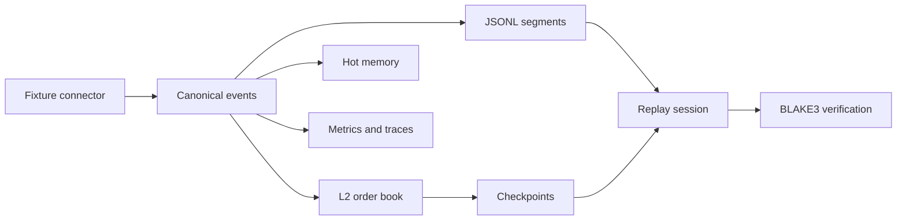

# Argus architecture

- **Contracts:** canonical IDs, exchange/receive/process time, capabilities, provenance and serializable schemas.
- **Order book:** slab-backed levels, snapshot/delta application, sequence-gap handling and reference comparisons.
- **Transport foundation:** a typed command bus and SPSC ring. The current ring uses process-allocated memory; OS-backed interprocess shared memory is unfinished.
- **Storage/replay:** hot memory, append-only JSONL segments, seek indexes and hash-verified checkpoints. Branch overlays preserve the original event sequence.
- **Risk/audit:** envelope and lifecycle primitives plus an append-only hash chain. A live order router and reconciliation daemon are not implemented here.
- **Observability:** a registry, Prometheus text exposition, structured JSON logs, trace primitives and sensitive-value formatting.

The target topology is Terminal / Data Plane / Risk Daemon / Research. [ADRs](architecture/adr/) distinguish decisions from current implementation. There is **no finished GUI/dashboard** to screenshot; the diagram above is a diagram.

## Verification boundary

The implementation diagram describes inspected source paths. It is not a screenshot, a production deployment claim or a measured latency/throughput result. See [verification](VERIFICATION.md) and [roadmap](ROADMAP.md).
